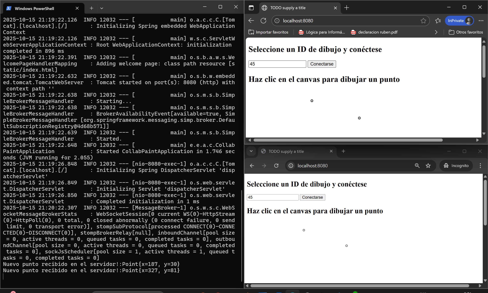

### Escuela Colombiana de Ingeniería

### Arquitecturas de Software - ARSW

---

### Integrantes

- Sergio Andrés Bejarano Rodríguez
- Laura Daniela Rodríguez Sánchez

---

### Laboratorio - Broker de Mensajes STOMP con WebSockets + HTML5 Canvas.

- Conectarse con un botón
- publicar con eventos de mouse

var newpoint = JSON.parse(greeting.body);
addPointToCanvas(newpoint);

stompClient.send("/topic/newpoint", {}, JSON.stringify(pt));

Este ejercicio se basa en la documentación oficial de SprinbBoot, para el [manejo de WebSockets con STOMP](https://spring.io/guides/gs/messaging-stomp-websocket/).

En este repositorio se encuentra una aplicación SpringBoot que está configurado como Broker de mensajes, de forma similar a lo mostrado en la siguiente figura:


En este caso, el manejador de mensajes asociado a "/app" aún no está configurado, pero sí lo está el broker '/topic'. Como mensaje, se usarán puntos, pues se espera que esta aplicación permita progragar eventos de dibujo de puntos generados por los diferentes clientes.

## Parte I.

Para las partes I y II, usted va a implementar una herramienta de dibujo colaborativo Web, basada en el siguiente diagrama de actividades:


Para esto, realice lo siguiente:

_1. Haga que la aplicación HTML5/JS al ingresarle en los campos de X y Y, además de graficarlos, los publique en el tópico: /topic/newpoint . Para esto tenga en cuenta (1) usar el cliente STOMP creado en el módulo de JavaScript y (2) enviar la representación textual del objeto JSON (usar JSON.stringify). Por ejemplo:_

```javascript
//creando un objeto literal
stompClient.send("/topic/newpoint", {}, JSON.stringify({ x: 10, y: 10 }));
```

```javascript
//enviando un objeto creado a partir de una clase
stompClient.send("/topic/newpoint", {}, JSON.stringify(pt));
```

En el archivo estático `app.js` observamos la función `connectAndSubscribe`. Haremos que se
conecte al tópico `/topic/newpoint` y que envíe la representación textual del objecto JSON del punto.

```javascript
var connectAndSubscribe = function () {
  console.info("Connecting to WS...");
  var socket = new SockJS("/stompendpoint");
  stompClient = Stomp.over(socket);

  //subscribe to /topic/TOPICXX when connections succeed
  stompClient.connect({}, function (frame) {
    console.log("Connected: " + frame);
    stompClient.subscribe("/topic/newpoint", function (eventbody) {
      var newpoint = JSON.parse(eventbody.data);
      addPointToCanvas(newpoint);
    });
  });
};
```

En el retorno de `app.js`, en la función `publishPoint`, haremos que se dibuje el punto y
posteriormente lo mande al servidor usando STOMP.

```javascript
publishPoint: function(px,py){
    var pt=new Point(px,py);
    console.info("publishing point at "+ JSON.stringify(pt));

    addPointToCanvas(pt);

    stompClient.send("/topic/newpoint", {}, JSON.stringify(pt));
}
```

_2. Dentro del módulo JavaScript modifique la función de conexión/suscripción al WebSocket, para que la aplicación se suscriba al tópico "/topic/newpoint" (en lugar del tópico /TOPICOXX). Asocie como 'callback' de este suscriptor una función que muestre en un mensaje de alerta (alert()) el evento recibido. Como se sabe que en el tópico indicado se publicarán sólo puntos, extraiga el contenido enviado con el evento (objeto JavaScript en versión de texto), conviértalo en objeto JSON, y extraiga de éste sus propiedades (coordenadas X y Y). Para extraer el contenido del evento use la propiedad 'body' del mismo, y para convertirlo en objeto, use JSON.parse. Por ejemplo:_

```javascript
var theObject = JSON.parse(message.body);
```

Actualizaremos la función `connectAndSubscribe` para que con el punto recibido sea posible
desglosar las coordenadas 'x', 'y' y mandar una alerta que notifique el nuevo punto.

```javascript
var connectAndSubscribe = function () {
  console.info("Connecting to WS...");
  var socket = new SockJS("/stompendpoint");
  stompClient = Stomp.over(socket);

  //subscribe to /topic/TOPICXX when connections succeed
  stompClient.connect({}, function (frame) {
    console.log("Connected: " + frame);
    stompClient.subscribe("/topic/newpoint", function (message) {
      var receivedPoint = JSON.parse(message.data);
      var x = receivedPoint.x;
      var y = receivedPoint.y;
      alert(`Nuevo punto recibido:\nX: ${x}, Y: ${y}`);
      addPointToCanvas(receivedPoint);
    });
  });
};
```

_3. Compile y ejecute su aplicación. Abra la aplicación en varias pestañas diferentes (para evitar problemas con el caché del navegador, use el modo 'incógnito' en cada prueba)._

Compilamos con `mvn clean install`.

```
[INFO] Installing C:\Users\Laura\Downloads\ARSW\T2\HTML5_JS_STOMP_WebSockets\target\websockets-msbroker-example-0.0.1-SNAPSHOT.jar to C:\Users\Laura\.m2\repository\edu\eci\arsw\msgbroker\websockets-msbroker-example\0.0.1-SNAPSHOT\websockets-msbroker-example-0.0.1-SNAPSHOT.jar
[INFO] Installing C:\Users\Laura\Downloads\ARSW\T2\HTML5_JS_STOMP_WebSockets\pom.xml to C:\Users\Laura\.m2\repository\edu\eci\arsw\msgbroker\websockets-msbroker-example\0.0.1-SNAPSHOT\websockets-msbroker-example-0.0.1-SNAPSHOT.pom
[INFO] ------------------------------------------------------------------------
[INFO] BUILD SUCCESS
[INFO] ------------------------------------------------------------------------
[INFO] Total time:  10.422 s
[INFO] Finished at: 2025-10-15T17:02:38-05:00
[INFO] ------------------------------------------------------------------------
```

Ejecutamos con `mvn spring-boot:run`.

```
2025-10-15 17:00:49.524  INFO 2604 --- [           main] o.s.b.w.embedded.tomcat.TomcatWebServer  : Tomcat started on port(s): 8080 (http) with context path ''
2025-10-15 17:00:49.526  INFO 2604 --- [           main] o.s.m.s.b.SimpleBrokerMessageHandler     : Starting...
2025-10-15 17:00:49.526  INFO 2604 --- [           main] o.s.m.s.b.SimpleBrokerMessageHandler     : BrokerAvailabilityEvent[available=true, SimpleBrokerMessageHandler [org.springframework.messaging.simp.broker.DefaultSubscriptionRegistry@44fdce3c]]
2025-10-15 17:00:49.526  INFO 2604 --- [           main] o.s.m.s.b.SimpleBrokerMessageHandler     : Started.
2025-10-15 17:00:49.536  INFO 2604 --- [           main] e.e.a.c.CollabPaintApplication           : Started CollabPaintApplication in 2.398 seconds (JVM running for 3.315)
2025-10-15 17:01:09.500  INFO 2604 --- [nio-8080-exec-1] o.a.c.c.C.[Tomcat].[localhost].[/]       : Initializing Spring DispatcherServlet 'dispatcherServlet'
2025-10-15 17:01:09.500  INFO 2604 --- [nio-8080-exec-1] o.s.web.servlet.DispatcherServlet        : Initializing Servlet 'dispatcherServlet'
2025-10-15 17:01:09.501  INFO 2604 --- [nio-8080-exec-1] o.s.web.servlet.DispatcherServlet        : Completed initialization in 1 ms
2025-10-15 17:01:49.000  INFO 2604 --- [MessageBroker-2] o.s.w.s.c.WebSocketMessageBrokerStats    : WebSocketSession[6 current WS(6)-HttpStream(0)-HttpPoll(0), 6 total, 0 closed abnormally (0 connect failure, 0 send limit, 0 transport error)], stompSubProtocol[processed CONNECT(6)-CONNECTED(6)-DISCONNECT(0)], stompBrokerRelay[null], inboundChannel[pool size = 16, active threads = 0, queued tasks = 0, completed tasks = 36], outboundChannel[pool size = 6, active threads = 0, queued tasks = 0, completed tasks = 6], sockJsScheduler[pool size = 8, active threads = 1, queued tasks = 7, completed tasks = 14]
```

Abrimos en varias pestañas en el modo incógnito.


_4. Ingrese los datos, ejecute la acción del botón, y verifique que en todas la pestañas se haya lanzado la alerta con los datos ingresados._

Creamos el punto en la tercera pestaña y salta esta alerta en la misma:


En la segunda:


En la primera:


_5. Haga commit de lo realizado, para demarcar el avance de la parte 2._

```bash
git commit -m "PARTE 1".
```

---

## Parte II.

Para hacer mas útil la aplicación, en lugar de capturar las coordenadas con campos de formulario, las va a capturar a través de eventos sobre un elemento de tipo \<canvas>. De la misma manera, en lugar de simplemente mostrar las coordenadas enviadas en los eventos a través de 'alertas', va a dibujar dichos puntos en el mismo canvas. Haga uso del mecanismo de captura de eventos de mouse/táctil usado en ejercicios anteriores con este fin.

_1. Haga que el 'callback' asociado al tópico /topic/newpoint en lugar de mostrar una alerta, dibuje un punto en el canvas en las coordenadas enviadas con los eventos recibidos. Para esto puede [dibujar un círculo de radio 1](http://www.w3schools.com/html/html5_canvas.asp)._

En el archivo `index.html` modificamos el body removiendo los campos de entrada
y agregando un título.

```html
<body onload="app.init()">
  <h2>Haz clic en el canvas para dibujar un punto</h2>
  <canvas id="canvas" width="800" height="600"></canvas>
</body>
```

En `app.js` ahora se retornará solamente una función de inicio donde se conectará al websocket
y definirá el manejador de eventos para el canvas.

```javascript
init: function () {
    var can = document.getElementById("canvas");

    //websocket connection
    connectAndSubscribe();

    canvas.addEventListener("click", function (evt) {
    var pos = getMousePosition(evt);
    var pt = new Point(pos.x, pos.y);
    console.info("Enviando punto: " + JSON.stringify(pt));
    addPointToCanvas(pt);
    socket.send("/topic/newpoint", {}, JSON.stringify(pt))
    });
},
```

_2. Ejecute su aplicación en varios navegadores (y si puede en varios computadores, accediendo a la aplicación mendiante la IP donde corre el servidor). Compruebe que a medida que se dibuja un punto, el mismo es replicado en todas las instancias abiertas de la aplicación._

Volvemos a realizar las pruebas en tres diferentes navegadores para comprobar que se
cree correctamente el punto y este se vea reflejado en las otras instancias.

Comparamos Chrome y Edge.


_3. Haga commit de lo realizado, para marcar el avance de la parte 2._

```bash
git commit -m "PARTE 2".
```

## Parte III.

Ajuste la aplicación anterior para que pueda manejar más de un dibujo a la vez, manteniendo tópicos independientes. Para esto:

_1. Agregue un campo en la vista, en el cual el usuario pueda ingresar un número. El número corresponderá al identificador del dibujo que se creará._

Agregamos el campo en el body de `index.html`:

```html
<body>
  <h2>Seleccione un ID de dibujo y conéctese</h2>
  <input type="number" id="drawingId" placeholder="Ingrese ID del dibujo" />
  <button onclick="app.connect()">Conectarse</button>

  <h2>Haz clic en el canvas para dibujar un punto</h2>
  <canvas id="canvas" width="800" height="600"></canvas>
</body>
```

Comprobamos que se vea reflejado en la página.


_2. Modifique la aplicación para que, en lugar de conectarse y suscribirse automáticamente (en la función init()), lo haga a través de botón 'conectarse'. Éste, al oprimirse debe realizar la conexión y suscribir al cliente a un tópico que tenga un nombre dinámico, asociado el identificador ingresado, por ejemplo: /topic/newpoint.25, topic/newpoint.80, para los dibujos 25 y 80 respectivamente._

- Primero creamos en `app.js` la siguiente variable:

```javascript
var drawId = null;
```

- Modificamos la función de inicio a una donde solo se iniciará cuando
  se de clic al botón de conectarse.

```javascript
connect: function () {
    drawingId = document.getElementById("drawingId").value;
    if (!drawingId) {
        alert("Por favor, ingrese un ID de dibujo.");
        return;
    }

    console.info(`Conectando al dibujo ${drawingId}...`);
    connectAndSubscribe();

```

- Modificamos `connectAndSuscribe` concatenando el tópico con el id del dibujo guardado
  en la variable privada. Realizamos la suscripción.

```javascript
var connectAndSubscribe = function () {
  console.info("Conectando a WebSocket...");
  var socket = new SockJS("/stompendpoint");
  stompClient = Stomp.over(socket);

  stompClient.connect({}, function (frame) {
    console.log("Conectado: " + frame);

    var topic = `/topic/newpoint.${drawingId}`;
    stompClient.subscribe(topic, function (message) {
      var receivedPoint = JSON.parse(message.body);
      console.log(`Punto recibido en ${topic}:`, receivedPoint);
      addPointToCanvas(receivedPoint);
    });

    console.log(`Suscrito a ${topic}`);
  });
};
```

_3. De la misma manera, haga que las publicaciones se realicen al tópico asociado al identificador ingresado por el usuario._

Dentro de la función de conectar en el retorno se define el manejador de eventos para el
canvas y se cambia el tópico al cual se mandará el punto.

```javascript
var canvas = document.getElementById("canvas");
canvas.addEventListener("click", function (evt) {
  var pos = getMousePosition(evt);
  var pt = new Point(pos.x, pos.y);
  console.info(`Enviando punto a ${drawingId}: `, pt);

  addPointToCanvas(pt);

  var topic = `/topic/newpoint.${drawingId}`;
  stompClient.send(topic, {}, JSON.stringify(pt));
});
```

4.  Rectifique que se puedan realizar dos dibujos de forma independiente, cada uno de éstos entre dos o más clientes.

        ```bash
        git commit -m "PARTE 3".
        ```

    Realizamos la prueba:

- Los dos dibujos con id 1


- Los dos dibujos con id 2


- Dibujos con id diferente


## Parte IV.

Para la parte IV, usted va a implementar una versión extendida del modelo de actividades y eventos anterior, en la que el servidor (que hasta ahora sólo fungía como Broker o MOM -Message Oriented Middleware-) se volverá también suscriptor de ciertos eventos, para a partir de los mismos agregar la funcionalidad de 'dibujo colaborativo de polígonos':


Para esto, se va a hacer una configuración alterna en la que, en lugar de que se propaguen los mensajes 'newpoint.{numdibujo}' entre todos los clientes, éstos sean recibidos y procesados primero por el servidor, de manera que se pueda decidir qué hacer con los mismos.

Para ver cómo manejar esto desde el manejador de eventos STOMP del servidor, revise [puede revisar la documentación de Spring](https://docs.spring.io/spring/docs/current/spring-framework-reference/web.html#websocket-stomp-destination-separator).

1. Cree una nueva clase que haga el papel de 'Controlador' para ciertos mensajes STOMP (en este caso, aquellos enviados a través de "/app/newpoint.{numdibujo}"). A este controlador se le inyectará un bean de tipo SimpMessagingTemplate, un Bean de Spring que permitirá publicar eventos en un determinado tópico. Por ahora, se definirá que cuando se intercepten los eventos enviados a "/app/newpoint.{numdibujo}" (que se supone deben incluir un punto), se mostrará por pantalla el punto recibido, y luego se procederá a reenviar el evento al tópico al cual están suscritos los clientes "/topic/newpoint".

   ```java

   @Controller
   public class STOMPMessagesHandler {

   	@Autowired
   	SimpMessagingTemplate msgt;

   	@MessageMapping("/newpoint.{numdibujo}")
   	public void handlePointEvent(Point pt,@DestinationVariable String numdibujo) throws Exception {
   		System.out.println("Nuevo punto recibido en el servidor!:"+pt);
   		msgt.convertAndSend("/topic/newpoint"+numdibujo, pt);
   	}
   }

   ```

2. Ajuste su cliente para que, en lugar de publicar los puntos en el tópico /topic/newpoint.{numdibujo}, lo haga en /app/newpoint.{numdibujo}. Ejecute de nuevo la aplicación y rectifique que funcione igual, pero ahora mostrando en el servidor los detalles de los puntos recibidos.

**Implementación:**

Se modificó el cliente JavaScript (`app.js`) para que, al hacer clic en el canvas, los puntos se publiquen en el tópico `/app/newpoint.{numdibujo}` en vez de `/topic/newpoint.{numdibujo}`. De esta forma, los puntos son procesados primero por el servidor antes de ser reenviados a los clientes suscritos.

```javascript
// ...existing code...
var appTopic = `/app/newpoint.${drawingId}`;
stompClient.send(appTopic, {}, JSON.stringify(pt));
// ...existing code...
```

Con este cambio, al ejecutar la aplicación y dibujar puntos, se puede observar en la consola del servidor los detalles de los puntos recibidos, confirmando que el servidor está interceptando y reenviando los eventos correctamente.



3. Una vez rectificado el funcionamiento, se quiere aprovechar este 'interceptor' de eventos para cambiar ligeramente la funcionalidad:

i. Se va a manejar un nuevo tópico llamado '/topic/newpolygon.{numdibujo}', en donde el lugar de puntos, se recibirán objetos javascript que tengan como propiedad un conjunto de puntos.

Se implementó en el backend un nuevo tópico `/topic/newpolygon.{numdibujo}`. En este tópico, en vez de puntos individuales, se reciben objetos JavaScript que contienen una propiedad `points` con el conjunto de puntos que forman el polígono.

ii. El manejador de eventos de /app/newpoint.{numdibujo}, además de propagar los puntos a través del tópico '/topic/newpoints', llevará el control de los puntos recibidos(que podrán haber sido dibujados por diferentes clientes). Cuando se completen tres o más puntos, publicará el polígono en el tópico '/topic/newpolygon'. Recuerde que esto se realizará concurrentemente, de manera que REVISE LAS POSIBLES CONDICIONES DE CARRERA!. También tenga en cuenta que desde el manejador de eventos del servidor se tendrán N dibujos independientes!.

- Para manejar accesos concurrentes desde múltiples clientes, se utiliza `ConcurrentHashMap<String, List<Point>>` para mantener los puntos por dibujo.
- La lista por dibujo es protegida con un bloque `synchronized (points) { ... }` durante las operaciones de agregación y publicación, garantizando consistencia al calcular cuándo publicar el polígono y evitando condiciones de carrera.
- Tras publicar el polígono, se hace `points.clear()` dentro del mismo bloqueo para reiniciar el estado del dibujo de forma atómica.
- Esta estrategia asegura que, aun con múltiples clientes enviando puntos simultáneamente, el servidor publica polígonos con un conjunto de puntos consistente y no se pierden eventos.

Fragmento relevante del backend:

(Archivo: `src/main/java/edu/eci/arsw/collabpaint/STOMPMessagesHandler.java`)

```java
    // Almacena los puntos por cada dibujo (thread-safe)
    private ConcurrentMap<String, List<Point>> drawingPoints = new ConcurrentHashMap<>();

    @MessageMapping("/newpoint.{numdibujo}")
    public void handlePointEvent(Point pt, @DestinationVariable String numdibujo) throws Exception {
        System.out.println("Nuevo punto recibido en el servidor!:" + pt);
        msgt.convertAndSend("/topic/newpoint." + numdibujo, pt);

        // Acumular puntos para el dibujo
        drawingPoints.putIfAbsent(numdibujo, new ArrayList<>());
        List<Point> points = drawingPoints.get(numdibujo);
        synchronized (points) {
            points.add(pt);
            if (points.size() >= 4) {
                Polygon polygon = new Polygon(new ArrayList<>(points));
                msgt.convertAndSend("/topic/newpolygon." + numdibujo, polygon);
                points.clear();
            }
        }
    }
```

iii. El cliente, ahora también se suscribirá al tópico '/topic/newpolygon'. El 'callback' asociado a la recepción de eventos en el mismo debe, con los datos recibidos, dibujar un polígono, [tal como se muestran en ese ejemplo](http://www.arungudelli.com/html5/html5-canvas-polygon/).

El cliente se suscribe al tópico `/topic/newpolygon.{drawingId}`. Cuando recibe un objeto polígono, ejecuta un callback que dibuja automáticamente el polígono en el canvas conectando los puntos y rellenando el área.

Fragmento relevante del cliente:

```javascript
stompClient.subscribe(polygonTopic, function (message) {
  var polygonObj = JSON.parse(message.body);
  if (polygonObj.points && polygonObj.points.length > 0) {
    drawPolygon(polygonObj.points);
  }
});
// ...
var drawPolygon = function (points) {
  var canvas = document.getElementById("canvas");
  var ctx = canvas.getContext("2d");
  if (points.length < 3) return;
  ctx.beginPath();
  ctx.moveTo(points[0].x, points[0].y);
  for (var i = 1; i < points.length; i++) {
    ctx.lineTo(points[i].x, points[i].y);
  }
  ctx.closePath();
  ctx.fillStyle = "rgba(0, 150, 255, 0.3)";
  ctx.fill();
  ctx.strokeStyle = "#0033cc";
  ctx.lineWidth = 2;
  ctx.stroke();
};
```


iv. Verifique la funcionalidad: igual a la anterior, pero ahora dibujando polígonos cada vez que se agreguen cuatro puntos.

Se ajusta el condicional dentro del método handlePointEvent en la clase STOMPMessagesHandler para lograr que se dibujen los polígonos a partir de cuatro puntos:


4.  A partir de los diagramas dados en el archivo ASTAH incluido, haga un nuevo diagrama de actividades correspondiente a lo realizado hasta este punto, teniendo en cuenta el detalle de que ahora se tendrán tópicos dinámicos para manejar diferentes dibujos simultáneamente.

5.  Haga commit de lo realizado.

    ```bash
    git commit -m "PARTE FINAL".
    ```

### Criterios de evaluación

1. La aplicación propaga correctamente los puntos entre todas las instancias abierta de la misma, cuando hay sólo un dibujo.
2. La aplicación propaga correctamente los puntos entre todas las instancias abierta de la misma, cuando hay más de un dibujo.
3. La aplicación propaga correctamente el evento de creación del polígono, cuando colaborativamente se insertan cuatro puntos.
4. La aplicación propaga correctamente el evento de creación del polígono, cuando colaborativamente se insertan cuatro puntos, con 2 o más dibujos simultáneamente.
5. En la implementación se tuvo en cuenta la naturaleza concurrente del ejercicio. Por ejemplo, si se mantiene el conjunto de los puntos recibidos en una colección, la misma debería ser de tipo concurrente (thread-safe).
